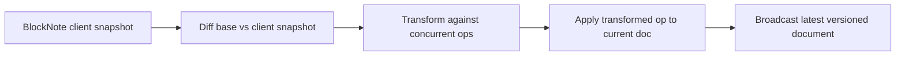

# BlockNote collaboration demo with jsonot

This example turns [BlockNote](https://github.com/TypeCellOS/BlockNote) into a **rich text collaboration backend** powered by `jsonot`.

It shows a practical pattern for editors that do not emit OT directly: the client sends snapshots, and the server uses `Diff`, `Transform`, and `Apply` to merge them.

## Who is this demo for?

Use this demo when you want to learn:

- how to build rich text collaboration in Go
- how to integrate `jsonot` with editors that send document snapshots
- how to run server-authoritative merging for structured block documents

## What will you see after running it?

- a BlockNote editor in the browser
- multiple clients editing the same block document
- server-side diff generation and concurrent rebase
- synchronized document versions across windows

## Directory

- `main.go`: Go WebSocket collaboration backend
- `web/index.html`: React + BlockNote frontend (ESM CDN)
- `go.mod`: standalone example module

## Run

```bash
cd examples/blocknote-collab
go mod tidy
go run .
```

Default address: `http://127.0.0.1:8080`

## How it works

1. open `http://127.0.0.1:8080`
2. open the same page in another browser window
3. edit the document in both windows
4. each client sends a `{ blocks: [...] }` snapshot
5. the server runs:
   - `Diff(baseSnapshot, clientSnapshot)` to generate OT
   - `Transform(clientOp, concurrentOps)` to rebase it
   - `Apply(currentDoc, transformedOp)` to update the authoritative document
6. the server broadcasts the latest version to other clients

## Architecture at a glance



## Protocol

Client message:

```json
{
  "type": "sync",
  "version": 3,
  "document": {
    "blocks": [
      {"type": "paragraph", "content": "hello"}
    ]
  }
}
```

Server messages:

- `init`: initial client, document, and version
- `ack`: confirms the submitting client
- `update`: broadcast for other clients
- `error`: sync failure

## Why this demo matters

This is the clearest repository example if you are evaluating:

- rich text collaboration backends in Go
- snapshot-to-OT merge pipelines
- how to connect `jsonot` to complex editors without writing editor-specific OT on the client

## Notes

- for stable `Diff` output, the server expects `document.blocks` to be a non-empty array
- this example uses a “snapshot up, OT merge on the server” model that is practical for complex editors
- production systems should add auth, rooms, persistence, reconnect flows, and cursor collaboration

## Related docs

- [Root README](../../README.md)
- [How to build collaborative editing in Go with JSON OT](../../docs/go-json-ot-collaboration.md)
- [How to use jsonot for JSON diff / revert](../../docs/json-diff-revert.md)
- [WebSocket collaboration demo](../websocket/README.md)
