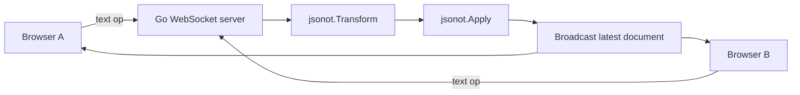

# WebSocket collaborative editing demo

This example shows how to build a **WebSocket collaborative editor backend in Go** with `jsonot`.

It sends text operations from the browser to the server, then uses `jsonot.Transform` and `jsonot.Apply` to merge concurrent edits and update the shared document.

## Who is this demo for?

Use this demo when you want to learn:

- how to wire `jsonot` into a minimal collaborative editing server
- how a server-authoritative OT loop looks over WebSocket
- how text subtype operations move between browser clients and a Go backend

## What will you see after running it?

- two browser tabs connected to the same document
- text edits sent as OT operations
- server-side rebase and apply behavior
- both tabs receiving the latest document content

## Repository structure

- `main.go`: HTTP + WebSocket backend
- `web/index.html`: browser client
- `go.mod`: standalone example module with a local `replace` back to the root `jsonot` module

## Run

```bash
cd examples/websocket
go run .
```

Default address: `http://127.0.0.1:8080`

## Demo flow

1. open `http://127.0.0.1:8080`
2. open the same page in a second browser tab or window
3. type in either window
4. the server rebases incoming text subtype operations with `jsonot.Transform`
5. the server applies them with `jsonot.Apply`
6. both windows receive the latest content

## Architecture at a glance



## Protocol

Client messages sent to `/ws`:

```json
{
  "type": "op",
  "version": 3,
  "op": [
    {"p": ["content"], "t": "text", "o": {"p": 4, "i": "abc"}}
  ]
}
```

Server messages:

- `init`: initial document and client ID
- `ack`: confirmation for the submitting client
- `update`: latest document broadcast to other clients
- `error`: parse or apply failure

## Why this demo matters

This is the fastest end-to-end path in the repository if you are evaluating:

- collaborative editing in Go
- WebSocket OT backends
- how `jsonot` fits inside a server-authoritative merge loop

## Notes

This implementation intentionally stays small:

- the collaborative document model is fixed to `{ "content": string }`
- the frontend maps a continuous edit into text subtype insert / delete operations
- the client temporarily locks input until it receives an acknowledgement

## Related docs

- [Root README](../../README.md)
- [How to build collaborative editing in Go with JSON OT](../../docs/go-json-ot-collaboration.md)
- [BlockNote collaboration demo](../blocknote-collab/README.md)
- [`jsonot/sharedb`](../../sharedb/README.md)
