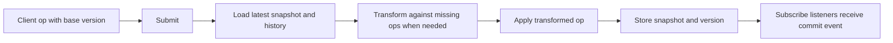

# jsonot/sharedb

`jsonot/sharedb` is a lightweight, ShareDB-style collaboration backend abstraction built on top of `jsonot`.

If you are searching for a **ShareDB alternative in Go**, a **Go collaboration backend**, or a **server-authoritative OT store**, this package is the best starting point in the repository.

## What problem does this package solve?

It gives you the backend building blocks that usually sit around an OT engine:

- document snapshots and versions
- client submit by base version (`Submit`)
- server-side rebase of concurrent operations with `Transform`
- subscription to committed updates (`Subscribe`)

The current implementation includes an in-memory `Store`, which is a good fit for demos, single-node services, prototypes, and custom wrappers.

## Who should use it?

Use `jsonot/sharedb` when you want to:

- build a ShareDB-style backend in Go
- keep the document authoritative on the server
- accept client operations against an older version and rebase them automatically
- wrap OT logic with a small backend API instead of designing every primitive from scratch

## Quick start

```go
package main

import (
"context"
"encoding/json"
"fmt"

"github.com/edocevol/jsonot/sharedb"
)

func main() {
ctx := context.Background()
store := sharedb.NewStore()

_, _ = store.CreateDocument(ctx, "doc-1", json.RawMessage(`{"counter":0}`))

result, _ := store.Submit(
ctx,
"doc-1",
0,
json.RawMessage(`[{"p":["counter"],"na":1}]`),
"client-a",
)

fmt.Println(result.Version)          // 1
fmt.Println(string(result.Document)) // {"counter":1}
}
```

## Request flow



## API

- `CreateDocument(ctx, documentID, initial)`: create a document at version `0`
- `GetSnapshot(ctx, documentID)`: get the latest snapshot
- `Submit(ctx, documentID, baseVersion, operation, source)`: submit an operation
- `Subscribe(ctx, documentID, buffer)`: subscribe to commit events

## How this relates to ShareDB

`jsonot/sharedb` is not a full ShareDB clone. It focuses on the backend primitives that are most useful when building your own Go collaboration service:

- snapshot + version management
- submit by version
- OT rebase on the server
- event subscription

That makes it a good choice when you want ShareDB-style ideas with a smaller, Go-native surface area.

## Smallest runnable path

1. `go get github.com/edocevol/jsonot/sharedb`
2. create a document with `CreateDocument`
3. submit an operation with `Submit`
4. read snapshots or subscribe to committed updates

## FAQ

### Is this a ShareDB alternative in Go?

It can be, if your goal is to build a Go-native backend with ShareDB-style concepts rather than to adopt the full ShareDB feature set.

### Does the server rebase old client operations?

Yes. When `baseVersion < currentVersion`, the server transforms the submitted operation against missing history before applying it.

### Can I use this in production?

The in-memory store is primarily aimed at demos and small services. For production, you will usually add persistence, isolation, auth, and operational controls on top.

## Notes

- `Submit` requires `baseVersion` to be in `[0, currentVersion]`
- when `baseVersion < currentVersion`, the server transforms the submitted operation against the missing history range
- subscription delivery is non-blocking; slow consumers may drop events unless you add a durable queue upstream

## Related docs

- [Root README](../README.md)
- [What is jsonot?](../docs/what-is-jsonot.md)
- [How to build collaborative editing in Go with JSON OT](../docs/go-json-ot-collaboration.md)
- [WebSocket collaboration demo](../examples/websocket/README.md)
