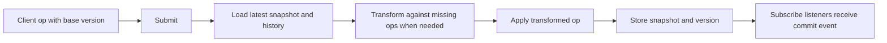

# jsonot/sharedb

`jsonot/sharedb` is a lightweight, ShareDB-style collaboration backend abstraction built on top of `jsonot`.

If you are searching for a **ShareDB alternative in Go**, a **Go collaboration backend**, or a **server-authoritative OT store**, this package is the best starting point in the repository.

## What problem does this package solve?

It gives you the backend building blocks that usually sit around an OT engine:

- document snapshots and versions
- atomic snapshot + op-log commits
- client submit by base version (`Submit`)
- server-side rebase of concurrent operations with `Transform`
- subscription to committed updates (`Subscribe`)

The current implementation includes an in-memory server for demos/tests plus pluggable backends, lockers, and publishers (including Redis adapters) for multi-process deployments.

## Who should use it?

Use `jsonot/sharedb` when you want to:

- build a ShareDB-style backend in Go
- keep the document authoritative on the server
- accept client operations against an older version and rebase them automatically
- wrap OT logic with a small backend API instead of designing every primitive from scratch
- expose operation history for reconnect/catch-up flows
- make client retries idempotent with `source` + `seq` / `OpID` metadata

## Quick start

```go
package main

import (
"context"
"encoding/json"
"fmt"

"github.com/edocevol/jsonot/sharedb"
)

func main() {
ctx := context.Background()
server := sharedb.NewMemoryServer()

_, _ = server.CreateDocument(ctx, "doc-1", json.RawMessage(`{"counter":0}`))

result, _ := server.Submit(
ctx,
"doc-1",
0,
json.RawMessage(`[{"p":["counter"],"na":1}]`),
"client-a",
)

fmt.Println(result.Version)          // 1
fmt.Println(string(result.Document)) // {"counter":1}
}
```

## Request flow


```mermaid
flowchart LR
    Client[Client op with base version] --> Submit[Submit]
    Submit --> Check[Load latest snapshot and history]
    Check --> Rebase[Transform against missing ops when needed]
    Rebase --> Apply[Apply transformed op]
    Apply --> Persist[Store snapshot and version]
    Persist --> Broadcast[Subscribe listeners receive commit event]
```

## API

- `CreateDocument(ctx, documentID, initial)`: create a document at version `0`
- `GetSnapshot(ctx, documentID)`: get the latest snapshot
- `Submit(ctx, documentID, baseVersion, operation, source)`: submit an operation
- `SubmitWithRequest(ctx, req)`: submit an operation with optional `OpID` / `Source` + `Sequence` idempotency metadata
- `GetOperations(ctx, documentID, fromVersion, toVersion)`: fetch committed operation history for versions `(fromVersion, toVersion]`
- `Subscribe(ctx, documentID, buffer)`: subscribe to commit events

## How this relates to ShareDB

`jsonot/sharedb` is not a full ShareDB clone. It focuses on the backend primitives that are most useful when building your own Go collaboration service:

- snapshot + version management
- atomic snapshot + operation history persistence
- submit by version
- OT rebase on the server
- operation history retrieval for reconnect/catch-up
- idempotent client retries with `OpID` (`source` + `seq`)
- event subscription

That makes it a good choice when you want ShareDB-style ideas with a smaller, Go-native surface area.

## Smallest runnable path

1. `go get github.com/edocevol/jsonot/sharedb`
2. create a document with `CreateDocument`
3. submit an operation with `Submit`
4. use `GetOperations` to catch up missed versions after reconnects, or `Subscribe` for live committed updates

## FAQ

### Is this a ShareDB alternative in Go?

It can be, if your goal is to build a Go-native backend with ShareDB-style concepts rather than to adopt the full ShareDB feature set.

### Does the server rebase old client operations?

Yes. When `baseVersion < currentVersion`, the server transforms the submitted operation against missing history before applying it.

### How should clients retry after a lost acknowledgement?

Use `SubmitWithRequest` and set a stable `OpID` (or the compatibility `Source` and monotonically increasing `Sequence` fields). If the same operation identity is submitted again with the same operation, the server returns `Duplicate: true`, returns the current snapshot, and does not apply the operation a second time. Reusing the same sequence for a different operation returns `ErrDuplicateSequenceConflict`.

### How does a reconnecting client catch up?

Call `GetSnapshot` to learn the current version, or call `GetOperations(ctx, docID, lastSeenVersion, currentVersion)` to fetch the committed ops that produced versions `(lastSeenVersion, currentVersion]`.

### Can I use this in production?

The in-memory store is primarily aimed at demos and small services. For production, you will usually add persistence, isolation, auth, and operational controls on top.

## Notes

- `Submit` requires `baseVersion` to be in `[0, currentVersion]`
- `SubmitWithRequest` deduplicates only when an operation identity is supplied via `OpID` or both `Source` and a positive `Sequence`
- `GetOperations` returns ops whose produced versions are in `(fromVersion, toVersion]`; each `OpRecord` includes `BaseVersion`, original `SubmittedOp`, transformed committed `Op`, and operation identity
- successful non-empty submits use `Backend.CommitOp` so the snapshot version and op log advance together
- when `baseVersion < currentVersion`, the server transforms the submitted operation against the missing history range
- subscription delivery is non-blocking; slow consumers may drop events unless you add a durable queue upstream

## Related docs

- [Root README](../README.md)
- [What is jsonot?](../docs/what-is-jsonot.md)
- [How to build collaborative editing in Go with JSON OT](../docs/go-json-ot-collaboration.md)
- [WebSocket collaboration demo](../examples/websocket/README.md)
